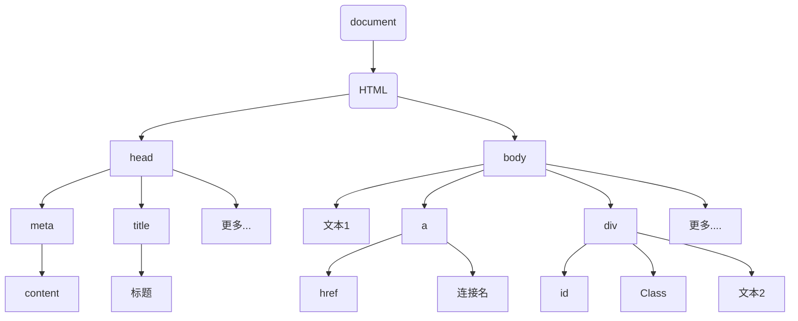
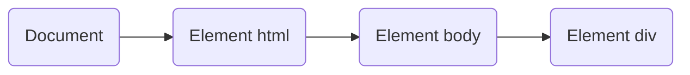
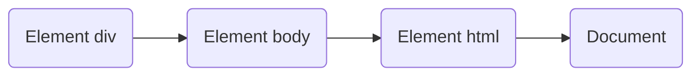

---
Title:JavaScript + WebAPIs
Author:连华煊
CreationDate:2024.1.26
Tags:[Program,JavaScript,WebAPIs]
---

# JavaScript + WebAPIs

# 目录

[TOC]


# 资源

**提示：**<kbd>Ctrl+鼠标左键</kbd>访问链接、文件。

**学习资源：b站黑马程序员、菜鸟教程、MDN官方文档，MoonshotAI**。

[1]: https://www.bilibili.com/video/BV1Y84y1L7Nn	"黑马程序员Js课程从入门到精通"
[2]: https://www.runoob.com/	"菜鸟教程"
[3]: https://developer.mozilla.org/zh-CN/	"MDN前端资料查询"
[4]: https://www.moonshot.cn/	"MoonshotAI月之暗面"
[5]: https://www.processon.com/diagrams	"流程图制作"

[6]:https://swiper.com.cn/	"Swiper插件，可以直接使用现成的轮播图"

**文件：**

* [JS事件](./JS事件)

* [JS实例](./JS实例.md)

[^propagation]: V. 流动、传播的意思

[^L0阶段]: L0阶段即Level0阶段， 也就是捕获阶段。在这个阶段，事件从最顶层的DOM元素（如`document`或`window`）开始向下传递，直到到达目标元素（即实际触发事件的元素）。在捕获阶段，事件处理程序按照从父元素到子元素的顺序执行。捕获阶段主要用于那些需要在事件到达目标元素之前进行处理的场景，例如全局事件监听。
[^L2阶段]: L2阶段即Level2阶段，也就是冒泡阶段，在这个阶段，事件从目标元素开始向上传递，回到最顶层的DOM元素。在冒泡阶段，事件处理程序按照从子元素到父元素的顺序执行。这是大多数开发者熟悉的事件处理方式，因为大多数事件监听器都是在冒泡阶段触发的。

> [!tip]
>
> div内部居中小技巧：给div设置高度后，将行高line-height设置跟行高相同，同时设置text-align:center即可。

<span style='color:rgb(238, 5, 43);font-size:18px'>红色重点样式：</span><span style='color:rgb(238, 5, 43);font-size:18px'></span>

# JS基础

## 一、JS书写位置

1. 内部JS
2. 行内JS
3. 外部JS

- 内部JS即写在<body>标签中，处于</body>标签上方


```html
<body>
  ...
  <script>
  	...
  </script>
</body>
```

- 行内JS就是写在标签内部，与内联CSS样式相同。

```html
<body>
	...
	<button onclick=""></button>
</body>
```

- 外部JS，使用src来指定JS位置，使用外部JS时，<script>标签内通常不再添加另外的JS代码，添加也无效。

```html
<body>
	...
	<script src="..."></script>
</body>
```

------

## 二、JS的输入输出

- 输入，通常使用prompt进行输入。

```js
prompt('请输入姓名：')
```


- 输出方式一：将文字输出到文档流，也就是输出到body中：

```js
document.write('输出1')
	//同时也可以添加标签指定输出文字的格式
document.write('<h1>我是标题</h1>')
```


- 输出方式二：弹出对话窗口，使用alert

```
alert('弹出对话框')
```


- 输出方式三：在控制台中输出，用户看不到。

```
console.log('输出到控制台')
```


> [!important]
>
> 执行优先级：alert()和prompt()它们会跳过页面渲染先被执行，优先级较高。

* 输出方式四：打印对象`console.dir()`

````js
<body>
  	<div>123</div>
		<script>
  		const div = document.querySelector('div')
		  console.dir(div)	//打印对象
 		</script>
  </body>
````


------

## 三、字面量

<u>在计算机科学中，字面量是在计算机中描述  ***事或物。***</u>

例如：

1. 1000就是数字字面量
2. 'String'就是字符串字面量
3. []就是数组字面量
4. {}就是对象字面量

------

## 四、变量

**1.1声明变量**

语法：`let 变量名`

> [!important]
>
> **由字母、数字、下划线和美元符号组成**
>
> **声明变量有两部分构成：声明关键字 、 变量名**
>
> **let即关键字，所谓关键字是系统提供的的专门用来声明（定义）变量的词语**
>
> **变量名遵守小驼峰命名法，第一个单词小写，第二个单词首字母大写，例如userName**
>
> **类名遵循大驼峰命名法，每个单词首字母大写**

例如：`let age`

**1.2变量赋值**

可以使用let或者var关键字，但是**<u>let不允许多次声明一个变量</u>**

> [!tip]
>
> 现在基本不用var声明变量，新版改为let。

```js
let age=12   //给age赋值12
alert(age)   //使用alert输出age
```


声明多个变量可以使用**逗号**隔开     `let age=18,username='Jack'`

同时输出也可以使用逗号隔开  	`console.log(age,year)` `document.write(age,year)`

> [!tip]
>
> 为了更好的可读性，建议一行只声明一个变量。


------

## 五、数组

### 1.数组的声明

- 声明方法   `let 数组名 = [数据1,数据2,...,数据n]`
- **<u>数组内元素的数据类型可以是任意的</u>**
- **可以通过  `数组名.length` 的方式来获取数组长度**

### 2.使用数组

1. 数组下标从0开始计算
2. 打印数组名即可打印数组全部内容
3. 访问数组某个元素方法   `数组名[下标]`

```js
let arr = [44,22,66]
console.log(arr)
console.log(arr[1])
```


#### **遍历数组**

使用`for in`可以遍历数组

```js
let arr = [12,32,41,55]
for(let i in arr){
	console.log(arr[i])
}
```

### 3.操作数组-新增

- `数组.push(元素1,...,元素n)`方法 ==将一个或多个元素添加到数组的**末尾**，并**返回**该数组的**新长度**==

```js
let num = [1,2,3]
console.log(num.lemgth)			//输出数组长度3
num.push(4)								//向末尾添加数字4
console.log(num,num.length)	 //输出数组长度4，以及数组[1,2,3,4]
```

- `数组.unshift(元素1,...,元素n)`方法 ==将一个或多个元素添加到数组的**开头**，并返回该数组的**新长度**==

```js
let num = [1,2,3]
console.log(num.length)			//输出数组长度3
num.unshift(12)						 //向开头添加数字12
console.log(num.length)			//输出数组长度4，以及数组[12,1,2,3]
```

### 4.操作数组-删除

- `数组.pop()`方法从数组中删除 ==最后一个元素==，并返回该元素的值，==这个方法不带参数==

```js
let num = [1,2,3,4]
num.pop()
console.log(num)			//输出1,2,3
console.log(num.pop())   //输出3，返回值是删除的元素
```

- `数组.shift()`方法从数组中删除 ==第一个元素==，并返回该元素的值， ==这个方法不带参数==
- `数组.splice(start,deleteCount)`方法，可以删除指定元素，接受两个参数，==一个是起始位置，另一个是删除元素个数。==**删除元素的个数是可选的，如果不选择，默认删除起始位置后面的全部元素。**

```js
let num = [1,2,3,4,5,6,7,8,9]
num.splice(2,2)
console.log(num)	//输出[1,2,5,6,7,8,9]
```

### 数组方法汇总

|              方法               | 说明                                                         |
| :-----------------------------: | ------------------------------------------------------------ |
|          `arr.push()`           | 将一个或多个元素添加到数组的**末尾**，并**返回**该数组的新长度 |
|         `arr.unshift()`         | 将一个或多个元素添加到数组的**开头**，并返回该数组的新长度   |
|           `arr.pop()`           | 从数组中删除 **最后一个元素**，并返回该元素的值，这个方法不带参数 |
|          `arr.shift()`          | 从数组中删除**第一个元素**，并返回该元素的值， 这个方法不带参数 |
| `arr.splice(start,deleteCount)` | 可以删除指定元素，接受两个参数，一个是起始位置，另一个是删除元素个数。**删除元素的个数是可选的，如果不选择，默认删除起始位置后面的全部元素。** |
|        `arr.includes()`         | 检测数组中是否存在某个元素                                   |

------

## 六、常量

- 使用const来声明的变量称为“常量”
- 当某个变量永远**不会改变**的时候，就可以使用const来声明，而不是let

```js
 //声明一个常量G
const G = 10
 //输出G
console.log(G)
```

- **常量不允许重新赋值，<u>声明的时候必须赋值</u>（初始化）**
- **不需要重新赋值的数据使用const**

------

## 七、数据类型

### 数据类型分类

基本数据类型

- number 数字型--整数、小数、正数、负数
- string 字符串型
- boolean 布尔类型
- undefined 未定义型
- null 空类型

引用数据类型

- object对象

> [!note]
>
> JS是弱数据类型语言，只有给变量赋值之后才知道变量的数据类型 let a = 3
>
> 区别与Java强数据类型语言，int a = 3   //已经确定了是整型

***数字型：***

如果对数字类型数据和其他类型进行运算操作，则会返回 'NaN(not a number)'，NaN是有粘性的，它与任何类型的数据进行运算，结果都是NaN。

### ***字符串类型***

通过单引号('')、双引号("")或者反引号(`)包裹的数据都叫字符串，单引号和双引号本质上没有区别，推荐使用单引号

> [!caution]
>
> **注意事项：**
>
> 1. 引号必须成对使用
> 2. 单双引号可以互相嵌套，但不能自己嵌套自己（外双内单，或者外单内双）
> 3. 可以使用转义字符  \  来输出引号

字符串拼接

+运算符 实现字符串的拼接

数字相加 字符相连

```js
  //数字相加
console.log(1+1)
  //字符相连
console.log('1'+'1')
```


### 模板字符串

模板字符串用于拼接字符串。

```js
	//以前使用的方法
console.write('我今年'+age'岁了')
	//模板字符串使用语法
console.write(`我今年${age}岁了`)
```

使用模板字符串需要**用反引号``包裹要输出的字符串**，在反引号内**使用${}**，并在大括号{}内添加需要输出的变量即可，语法为：

```
console.log(`${变量名}`)
```

------

布尔类型 boolean

1. 表示肯定或否定时在计算机中对应的是布尔类型的数据
2. **它有两个固定的值true 和 false**

```js
let isCool = true
console.log(isCool)
	//输出true
```

> [!tip]
>
> 只要不是空字符串，如果隐式转换成boolean类型的话结果都是true

------

### 未定义型 undefined

- **未定义是比较特殊的类型，只有一个值undefined**
- **只声明变量，不赋值的情况下，变量的默认值为undefined**，一般很少【直接】为某个变量赋值为undefined

```
let num
console.log(`num的类型为${num}`)
	//输出结果是undefined
```


> [!tip]
>
> **工作中的使用场景**
>
> 开发中经常声明一个变量，等待传送过来的数据。
>
> 如果不知道这个数据是否传递过来，此时我们可以通过检测这个变量是不是undefined，就判断用户是否有数据传递过来

------

null类型

JS中的null仅仅是一个代表”无“、”空“ 或 ”值未知“ 的特殊值。

```js
let age = null
console.log(age)
	//输出null
```


> [!note]
>
> **null和undefined的区别**
>
> - undefined表示没有赋值
> - null表示赋值了，但是内容为空
> - 官方解释：把null作为尚未创建的对象（将来有个变量里面存放的是一个对象，但是对象还没创建好，可以先给个null）
> - 二者计算结果也不同
>
> ```js
> console.log(undefined + 1)  //NaN
> console.log(null + 1)  		  //1
> ```

------

### 检测数据类型

typeof运算符可以返回被检测的数据类型。支持两种语法形式：

**1.作为运算符： ** `typeof x  //常用的写法`

**2.函数形式：**      `typeof(x)`

> [!tip]
>
> 有没有括号得到的结果都是一样的，为了方便，建议不加括号。

------

### 类型转换

1. ==JS是弱数据类型，JS也不知道变量到底属于哪种类型，只有赋值了之后才清楚。==
2. ==**使用表单、prompt获取过来的数据默认是字符串类型的，此时就不能直接简单的进行加法操作。**==

#### **隐式转换**

某些运算符背执行时，系统内部自动将数据类型进行转换，这种转换称为隐式转换

**规则：**

==**1.+号两边只要有一个是字符串，都会把另一个转换成字符串。**==

==**2.除了+以外的算术运算符，比如  减号 (-)、乘号 (*)、除号 ( / ) 等都会把数据转成数字类型。**==

**缺点：**

转换类型不明确，靠经验才能总结

**小技巧：**

1.+号作为正号解析可以转换成数字型

```js
console.log(+'123')  //此时字符串123就变成数字型123

//处理加法运算
let a = prompt('请输入第一个数：')  //输入第一个数
let b = prompt('请输入第一个数：')  //输入第二个数
console.log((+a) + (+b))				  //将输入的两个字符串使用+转换成数字类型，再进行相加。
```

2.任何数据和字符串相加结果都是字符串

------

#### **显示转换**

编写程序时过度依赖系统内部的隐式转换时不严谨的，因为隐式转换规律并不清晰，大多靠经验总结的规律，为了避免因隐式转换带来的问题给i，通常根据逻辑需要对数据进行显示转换。

**概念：**

自己写代码告诉系统该转成什么类型

**转换语法：**  `数据类型(数据)`

```js
//将输入的数字从字符串转换成数字类型

//方法一
let a = prompt('请输入一个数：')
Number(a)																//对变量进行类型转换

//方法二
let a = Number(prompt('请输入一个数字：'))	//直接在输入语句进行类型转换
console.log(a)

//方法三
let a = +prompt('请输入一个数：')					//使用+将输入的类型转换为数字型
```

> [!tip]
>
> 转换为数字型：
>
> 如果字符串内容里有非数字，转换失败时结果为NaN
>
> NaN也是Number类型的数据，代表非数字

保留整数  `parseInt()`

保留小数  `parseFloat()`

```js
console.log(parseInt(`12px`))				//12
console.log(parseFloat(`12.4px`))		//12.4
//以下是错误写法
console.log(parseInt(abc12px))			//这种情况无法直接获取数字
console.log(parseFloat(abc12.4px))   //这种情况同理
```

#### 转换为Boolean类型

**0、undefined、null、false、NaN、空字符(字符串)转换为布尔值后都为false，其余则为true**

#### **逻辑&&||补充**

两个变量进行逻辑运算。结果并不是真或假，而是第一个或最后一个为真的变量的值或0，例如

```
let a=5
let b=10
console.log(a&&b)  //结果为10，二者都为真，结果是最后一个为真的值
a=0
b=5
console.log(a||b)	    //结果为5，原理相同。
```


------

## 八、运算符

1. **这里运算符只补充JS与C语言不相同的运算符**
2. **比较运算符的结果为boolean类型的true或false**

- ==  ：**等于运算符**，判断左右两边的值是否相等
- ===：**全等运算符**，判断左右两边**是否类型和值都相等**


- !== ：**不全等运算符**，判断左右两边是否不全等，<mark>**判断值是否不相等，同时判断类型是否不相同。**</mark>

==开发过程中，判断两数是否相等建议使用**全等运算符**==

- **NaN不等于任何数，包括它自己，只要涉及到NaN的比较结果都为false。**

```js
console.log(NaN === NaN)  //结果为false
```

- ==**比较运算符有隐式转换，会把字符型的转换成数字型的**==

```js
console.log(2=='2')  //结果为true  比较运算符把字符'2'隐式转换成数字2
console.log(2==='2') //结果为false，全等运算符判断值和类型是否相等
```

- **字符串比较，比较的是ACSCII码值**

```js
console.log('a' < 'b')		//true
console.log('aa' < 'ab')	//true,如果比较字符串为一个以上则逐个比较
console.log('aa'<'aac')		//true,字符串越长的越大
```

------

## 九、函数

1. 具名函数
2. 匿名函数

**函数命名规范**

- 和变量命名基本一致
- 尽量小驼峰命名法
- 前缀应该为动词

- 命名建议：常用动词约定

| 动词 |           含义           |
| ---- | :----------------------: |
| can  | 判断是否可以执行某个动作 |
| has  |    判断是否含有某个值    |
| is   |     判断是否为某个值     |
| get  |        获取某个值        |
| set  |        设置某个值        |
| load |       加载某些数据       |

> [!note]
>
> **补充：**
>
> ==**JS中定义函数的参数只需要写变量名即可，不需要加声明**==，例如：
>
> ```js
> function(num1,num2){
> 	document.write(num1+num2)
> }
> ```

### 作用域

1. **全局作用域。函数外部或整个script内有效。**
2. **局部作用域。也称为函数作用域，在函数内部有效。**

### 匿名函数

> [!tip]
>
> 没有名字的函数，无法直接使用

使用方法：

- **函数表达式**
- **立即执行函数**

1.函数表达式：==将匿名函数赋值给一个变量，并且通过变量名进行调用==，我们将这个称为函数表达式。

语法：

```js
let fn = function(){
	//函数体
}
fn()	//调用函数
```

> [!note]
>
> **具名函数和匿名函数二者区别：具名函数的调用可以写在任何位置，而匿名函数只能在函数赋值给变量之后。**

2.立即执行函数

语法：

```js
//立即执行函数，也就是将函数体的声明用小括号抱起来，再加一对小括号进行调用，末尾记得加分号。说的简单一点就是定义后立即调用。
(function(形参列表){ } )(实参列表);  
 //将函数展开
( function(形参列表) {
  //函数体
} ) (实参列表); 
```

> [!note]
>
> 立即执行函数的作用：防止变量污染
>
> 立即执行函数不需要也没办法调用，其实本质已经调用了，多个立即执行函数之间用分号隔开。

------

## 十、对象

- 对象的概念：

  - JS里的一种引用==数据类型==

  - 可以理解为是一种==无序的数据集合==

  - 用来描述某个事物，或者描述一个人

```js
let obj = {
	uname: 'jack',
	age: 18,
	gender: '男',
}	//创建了一个对象
```

- 对象声明语法：`let 对象名 = {}`或 `let 对象名 = new object()`，{ }是对象字面量。
- **对象由属性和方法组成**
  - ==属性==：信息或叫特征（名词）。比如 手机尺寸、颜色、重量等...
  - ==方法==：功能或叫行为（动词）。比如 手机打电话、发短信、玩游戏等...

**属性的特点**：

1. 属性都是成对出现的，包括属性名和值，它们之间使用英文  :  分隔。
2. 多个属性之间使用英文  ,   分隔。
3. 属性就是依附在对象上的变量（外面是变量，对象内是属性）。
4. 属性名可以使用  "" 或  ''，一般情况下省略，除非名称遇到特殊符号，如空格、中横线等。

### 对象的属性

- 对象本质是无序的数据集合，操作数据无非就是==增 删 查 改==语法：

**属性-查**

1. 声明对象，并添加了如果属性后，可以使用  . 操作符获取对象中属性对应的值，称之为属性访问。
2. 语法1： `对象名.属性`。
3. 语法2： `对象名['属性名']`。
4. 简单理解就是获取对象里面的值。

**属性-改**

1. 语法：`对象名.属性 = 新值`

**属性-增**

1. 语法：`对象名.属性 = 新值`
2. ==语法与改相同==
3. ==如果原来的对象中有此属性，则进行修改，没有则进行新增。==

**属性-删**

1. 语法：`delete 对象名.属性名`
2. 新版语法不推荐delete操作，后续会添加新的删除方法

### 对象的方法

**数据的行为性的信息称为方法，如跑步、唱歌等，一般是动词性的，其本质是函数。**

1. 方法是由方法名和函数两部分构成，他们之间使用  :  分隔。
2. 多个属性之间使用英文  ,   分隔。
3. 方法是依附在对象中的函数。
4. 方法名可以使用  ""  或  ''，一般情况下省略，除非给遇到特殊符号，如空格、中横线等。

创建方法的语法：`方法名: function(){函数体}`

调用语法：`对象名.方法名()`

```js
let obj = {
	uname = 'jack',
	say: function (){
		console.log('HelloWorld!')
	}
}
obj.say()	//调用obj对象中的say方法
```

### 遍历对象

- **使用`for in`遍历对象**

```js
let people = {
      uname:'jack',
      age:18,
      gender:'男',
      sing: function(){			//sing方法
        console.log('唱歌')
      },
      dance: function(){	  //dance方法
        console.log('跳舞')
      }
    }		//创建一个people对象
    for(let i in people){			//遍历对象
      console.log(i)				//打印属性名
      console.log(people[i])   //打印属性值
    }
```

**重点来了**

**在上面的for循环中，直接打印循环变量的话，获取到的是属性名，==属性名是以字符串的形式保存的，==也就是`'uname','age','gender'`，如果直接使用`people.k`来访问会出错，原因是使用`people.k`等价与`people.'uname'`，而上面说过，访问属性的第二种方式为`对象名['属性名']`，而k保存的正是字符串形式的属性名，由此可以得出应该使用`对象名[循环变量]`的方式来获取属性中的值。**

**总结：**

1. 使用`for in`来获取到的属性名是以字符串的形式保存的。
2. 在`for in`中访问属性值应当使用`对象名[循环变量]`的方式。
3. 因为`for in`中循环变量是以`'属性名'`这样的字符串形式保存，`对象名[循环变量]`也就等价与`对象名['属性名']`的访问方式。

### 内置对象-Math

- **介绍：**Math对象是JS提供的一个“数学”对象
- **作用：**提供了一系列数学运算的方法

Math对象包含的方法有：

| 方法   | 解释                |
| :----- | :------------------ |
| random | 生成0-1之间的随机数 |
| ceil   | 向上取整            |
| floor  | 向下取整            |
| max    | 找最大值            |
| min    | 找最小值            |
| pow    | 幂运算              |
| abs    | 绝对值              |

生成N-M之间的随机数公式：

```js
Math.floor(Math.random( )*(M-N+1))+N
```

------

# WebAPIs

**WebAPIs的作用和分类**

- 作用：就是使用JS去操作html和浏览器
- 分类：DOM（文档对象类型）、BOM（浏览器对象类型）

## DOM

### DOM基本内容

#### DOM简介

- DOM（**Document Object Model——文档对象模型**）是用来呈现以及与任意HTML或XML文档交互的API。
- DOM是浏览器提供的一套专门用来==操作网页内容==的功能
- DOM的作用
  - 开发网页内容特效和实现用户交互

#### DOM树

DOM树简介

- 将HTML文档以==树状结构==直观的表现出来，我们称之为文档树或DOM树。
- 描述网页内容关系的名词
- 作用：==文档树直观的体现了标签与标签之间的关系==



#### DOM对象

==浏览器根据HTML标签生成对应的JS对象==

* 所有的标签属性都可以再这个对象上面找到
* 修改这个对象的属性会自动映射到标签身上

DOM的核心思想

* 把网页内容当做 _**对象**_ 来处理

DOM中最大的对象是document对象

* document是DOM里提供的一个对象
* 所以它提供的属性和方法都是用来==访问和操作网页内容的==，例如`document.write()`
* 网页所有内容都在document里面

简单获取对象

````js
<body>
  <div>123</div>
  <script>
  	const div = document.querySelector('div')	//获取div对象
	  console.dir(div)											//使用console.dir()方法打印对象
  </script>
</body>
````

> [!note]
>
> 区别：
>
> 在html中叫做标签，而在JS中获取到之后叫做对象

***

#### 获取DOM对象

1. 根据CSS选择器来获取DOM元素（重点）
2. 其他获取DOM元素方法（了解）

==查找DOM元素就是利用JS选择页面中标签元素==

#### 根据CSS选择器来获取DOM元素（重点）

1. 选择匹配的 **_第一个元素_**

**语法：**`document.querySelector('CSS选择器')`

> [!note]
>
> CSS选择器一定要用引号包起来，选择器可以获取标签、类名、id等
>
> 补充CSS选择器：
>
> 选择第一个`:first-child`
>
> 选择第n个  `:nth-child(n)`

**参数：**包含一个或多个有效的CSS选择器==字符串==

**返回值：**CSS选择器匹配的==第一个元素==，一个HTMLElement对象。

如果没有匹配到，则返回null。

2. 选择匹配的 **_多个元素_**

语法：`document.querySelectorAll('CSS选择器')`

**参数：**包含一个或多个有效的CSS选择器==字符串==

**返回值：**CSS选择器匹配的==NodeList对象集合==

获取出来的对象集合可以通过下标访问。

使用这种方法得到的是一个==伪数组==：

* 有长度有索引号的数组
* **但是没有`pop()`、`push()`等数组方法**
* 哪怕只有一个元素，通过`querySelectAll()`获取到的也是一个伪数组，里面只有一个元素

想要得到里面的每一个对象，则需要通过遍历的方式获得。

3. 获取到的单个元素可以直接修改属性，而获取到的NodeList并不能直接修改

**单个元素修改属性：**

- 先使用变量接收：`const dv = document.querySelect('div')`
- 直接修改属性：    `dv.style.color = 'red'`

````js
<body>
  <div>123</div>
  <div class="box">456</div>
  <div id="nav">abc</div>
  <ul>
    <li>测试1</li>
    <li>测试2</li>
  </ul>
  <script>
    const d1 = document.querySelector('div')	//获取标签
    const d2 = document.querySelector('.box')  //获取类名
    d2.style.color = 'red'	//修改属性值
    const d3 = document.querySelector('#nav')  //获取id
    const d4 = document.querySelector('ul li:first-child')	//获取ul下的第一个li
    const dA = document.querySelectorAll('ul li')	//获取ul下全部的li，是一个NodeList
    console.dir(dA[0])	//打印NodeList中的第0个元素，也就是第一个li元素
  </script>
</body>
````

#### 根据其他方法获取元素

- 根据id获取元素：`document.getElementById('')`

* 根据标签获取一类  获取页面所有div：`document.getElementsByTagName('div')`
* 根据类名获取元素  获取页面所有类名为w的：`document.getElementsByClassName('w')`

> [!tip]
>
> 后面两种获取的都是伪数组，第二种就是获取标签，第三种获取的是类名。由于标签不止一个，类名可以多次使用，所以他们获取到的都是伪数组。

***

### DOM操作元素内容

#### .innerText属性

- 将文本内容添加/更新到任意标签位置
- 显示纯文本，==不解析标签==

````js
<body>
  <div class="box">12344</div>
  <script>
    const dv = document.querySelector('.box')
    dv.innerText= '<b>sd</b>'		//修改div中显示的文字，不解析标签，所以<b></>会原样输出
  </script>
</body>
````

#### .innerHTML属性

* 将文本添加/更新到任意标签位置
* ==会解析标签==，多标签建议使用模板字符串

````js
<body>
  <div class="box">12344</div>
  <script>
    const dv = document.querySelector('.box')
    dv.innerHTML= '<b>sd</b>'		//修改div中显示的文字，会解析标签，所以sd文字会有加粗效果
  </script>
</body>
````

>[!tip]
>
>`.innerText`和`.innerHTML`区别：
>
>**前者不会解析标签，如果在修改的文字中添加加粗、斜体等标签，会把标签原样输出，并不会有特殊效果。**
>
>**后者会解析标签，如果在修改的文字中添加加粗、斜体等标签，显示的文字会有特殊效果。**

**_开发中推荐使用_ `.innerHTML`**

***

### DOM操作元素属性

#### 操作元素常用属性

* 可以通过JS设置 / 修改标签元素属性。比如通过src更换图片
* 常见的属性：href、title、src等

语法：`对象.属性 = 值`

**与JS基础相同，如果对象中没有存在这个属性，则添加，如果存在，则修改。**

#### 操作元素样式属性

1. 通过style属性操作CSS

语法：`对象.style.样式属性 = 值`

````js
const div = document.querySelector('div')
div.style.height = '400px'
div.style.width = '400px'
div.style.backgroundColor = 'red'
````

2. **通过类名(className)操作CSS**
* 如果修改的样式比较多，直接通过style属性修改比较繁琐，可以借助于CSS类名的形式
  
* ==先在style中添加需要修改的样式，并为此样式添加一个类名。在获取到元素后直接修改类名即可。==
  
* **如果单独写一个类名，那么新的样式会覆盖旧的样式，如果将两个类名写在一起，就可以同时满足**

语法：`元素.className = '类名'`。也可以添加多个类名`元素.className = '类名1 类名2'`，中间用空格隔开。

3. **通过classList操作类控制CSS**
   - 为了解决className容易覆盖以前的类名，我们可以通过classList方式追加和删除类名

语法：

| 操作                       | 说明       |
| -------------------------- | ---------- |
| `classList.add('类名')`    | 追加一个类 |
| `classList.remove('类名')` | 删除一个类 |
| `classList.toggle('类名')` | 切换一个类 |

> [!tip]
>
> `classList.toggle('类1')`说明：如果原来没有类1，那么就加上，如果原来就，那么就删掉。

#### 操作表单元素属性

* 表单很多情况下也需要修改属性，比如点击眼睛可以查看密码，本质是把表单类型转换为文本框
* 正常的有属性有取值的，跟其他的标签属性没有任何区别

语法：`DOM对象.属性名 = 值`

| 表单内容              | 说明                               |
| --------------------- | ---------------------------------- |
| `表单.type`           | 表单类型                           |
| `表单.value`          | 表单的值，也就是输入框中输入的内容 |
| `checked=true/false`  | 表示复选框是否选择，结果为布尔值   |
| `disabled=true/false` | 表示按钮是否禁用                   |

#### 自定义属性

* 标准属性：标签自带的属性 比如class、id、title等，可以直接使用`.`语法操作，比如：`disabled、checked、selected`
* 自定义属性：
  * 在h5中推出专门的`data-`自定义属性
  * 在标签上一律以`data-`开头
  * 在DOM对象上一律以`dataset`对象方式获取

````js
<body>
  <div data-id="1" data-scm="2">1</div>
  <div data-id="2">2</div>
  <div data-id="3">3</div>
  <div data-id="4">4</div>
  <div data-id="5">5</div>
  <script>
    const one = document.querySelector('div')
    console.log(one.dataset)
  </script>
</body>
````

在上述代码中，首先获取了第一个div对象，然后使用dataset打印出了第一个对象中所有的data自定义属性由于在第一个div中，有两个自定义属性，所以可以通过`.`操作符来访问其中某一个自定义属性，例如：

````js
<body>
  <div data-id="1" data-scm="2">1</div>
  <script>
    const one = document.querySelector('div')
    console.log(one.dataset.id)
  </script>
</body>
````

上面的代码演示了当一个标签中有多个自定义属性时，如何访问其中某一个自定义属性

***

### 定时器-间歇函数

**开启定时器**

- 语法：`setInterval(函数,间隔时间)`
- 作用：每隔一段时间调用这个函数，间隔时间单位时毫秒ms
- 调用函数只需要写函数名，不要加小括号：`setInterval(f1,2000)`

**关闭定时器**

````js
let 变量名 = setInterval(函数,间隔时间)
clearInterval(变量名)
````

***

### 事件

#### 事件基础

##### 事件监听

**事件的概念：**事件是在编程时系统内发生的动作或者发生的事情，比如用户在网页上单击一个按钮。

**事件监听：**就是让程序检测是否有事件产生，一旦有事件触发，就立即调用一个函数做出响应，也称为：==绑定事件或者注册事件==。比如：鼠标经过显示下拉菜单、点击可以播放轮播图等。

语法：`元素对象.addEventListener('事件类型',要执行的函数)`

<details style='display:inline'><summary>事件监听三要素</summary>
 <ul>
   <li><span style='background-color=black'>事件源：</span>哪个DOM元素事件触发了，要获取DOM元素。</li>
   <li>事件类型：用什么方式触发，比如单击click、鼠标经过mouseover等。</li>
   <li>事件调用的函数：要做什么事情。</li>
  </ul> 
 </details>
<kbd>ctrl+单击</kbd>打开[JS事件](./JS事件)

> [!tip]
>
> 可以通过`event.key`来检测用户当前按下的按键

##### 焦点事件

* 焦点事件一般用来获取表单的光标

语法：`focus`用于获取光标，`blur`用于失去光标

##### 事件对象

<details>
  <summary>语法：如何获取</summary>
	<ul>
    	<li>在事件绑定的回调函数的第一个参数就是事件对象</li>
    	<li>一般命名为event、ev、e</li>
  </ul>
</details>
`元素.addEventListener('click',funtion(e){})`

此处function中的参数e就是事件对象

部分常用属性：

* `type`:获取当前的事件类型
* `clientX/clientY`:获取光标相对于浏览器可见窗口左上角的位置
* `offsetX/offsetY`:获取光标相对于当前DOM元素左上角的位置
* `key`:用户按下的键盘键的值（现在不提倡使用KeyCode）

##### 环境对象

概念：环境对象指的是函数内部特殊的变量`this`，<span style='font-size:17px'><b>它代表着当前函数运行时所处的环境</b></span>

* 函数的调用方式不同，this指代的对象也不同
* 【谁调用，this就是谁】是判断this指向的<span style='background-color:yellow;color:black;padding:4px;border-radius:5px'>粗略规则</span>
* 直接调用函数，其实相当于是`window.函数`，所以this指代window

示例：

<span style='font-size:18px;color: burlywood;'>当this在普通函数中时所指的是window</span>

```js
//当this在普通函数中时
function fn(){
  console.log(this)
}
fn()
```


<span style='font-size:18px'>在监听事件中，谁调用了函数this就指向谁</span>

```js
<body>
  <button id="cl">Click</button>
  <script>
    const cl = document.querySelector('#cl')
    cl.addEventListener('click',function(){
      console.log(this)
    })
  </script>
</body>
```


在上面的代码中，以我们之前的写法，如果我们要修改`button`中`Click`字体的颜色，我们会这么写：

`cl.style.color='red'`如果使用`this`的写法，就可以写成`this.style.color='red'`。

##### 回调函数

<span style='font-size:18px;color:rgb(228, 64, 64)'>概念：如果将函数A做为参数传递给函数B时，我们称函数A为回调函数。</span>

```js
function A(){
  console.log('我是回调函数')
}
setInterval(A,1000)
```

在这个例子中函数A就是回调函数，函数A作为参数传递给定时器`setInterval()`函数。

```js
box.addEventListener('click',function(){
  console.log('回调函数')
})
```

这个例子中监听事件中的function也是一个回调函数，它作为参数给了事件监听函数。


***

#### 事件流

<span style='font-size:18px;color:rgb(228, 64, 64)'>概念：事件流指的是事件完整执行过程中的流动路径</span>

事件流的两个阶段：

* 捕获阶段
* 冒泡阶段

捕获阶段：（范围从大到小）



冒泡阶段：（范围从小到大）




* 说明：假设页面中有个div，当触发事件时，会经历两个阶段，分贝是捕获阶段，冒泡阶段
* 简单来说：捕获阶段是 ==从父到子==，冒泡阶段是 <span style='background-color:yellow;color:black;padding:4px;border-radius:5px'>从子到父</span>。
* 实际工作都是使用 ==事件冒泡== 为主。

##### 事件捕获

<span style='font-size:18px;color:rgb(228, 64, 64)'>概念：从DOM的根元素去执行对应的事件（从外到里）</span>

事件捕获需要写对应的代码才能看到效果：

```js
DOM.addEventListener('事件类型',函数,是否使用捕获)
```

> [!tip]
>
> 使用true或false来表示是否使用事件捕获

平时用的都是事件冒泡，也就是`.addEventLisetener()`的最后一个参数不写true或false。

示例：

```js
<body>
  <div class="father">
    <div class="son"></div>
  </div>
  <script>
    const fa = document.querySelector('.father')
    const son = document.querySelector('.son')
    document.addEventListener('click',function(){
      console.log('doc')
    },true)
    fa.addEventListener('click',function(){
      console.log('fa')
    },true)
    son.addEventListener('click',function(){
      console.log('son')
    },true)

  </script>
</body>
```

上面的代码中，在body里面有一对div类名为father，里面包着一个小div类名为son，在script中添加三个事件监听，并传入参数true来开启事件捕获，document代表着最大的文档，也就是页面的任意位置，当点击了son这个div时，结果如下：


由于事件捕获从外到里的性质，所以会先打印document，再打印外层div，最后打印内层div。

##### 事件冒泡

<span style='font-size:18px;color:rgb(228, 64, 64)'>概念：当一个元素的事件被触发时，同样的事件将会在该元素的所有祖先元素中依次触发</span>

* 简单理解：当一个元素触发事件后，会依次向上调用所有父级元素的 ==同名事件==
* 事件冒泡时默认存在
* 事件监听第三个参数时false，或者默认都是事件冒泡

也就是说事件冒泡和事件捕获是相反的，执行了上面的代码后，结果如下图：


> [!caution]
>
> 此处的事件冒泡效果是当用户点击了某一个元素时，触发了事件冒泡，一次性输出了三个。

#### 阻止冒泡

* **问题：**因为默认就有冒泡模式的存在，所以容易导致事件影响到父级元素
* **需求：**若想把事件就限制在当前元素内，就需要阻止事件冒泡
* 前提：需要先拿到事件对象
* **语法：**`对象.stopPropagation()` [^propagation] 
* **注意：**此方法可以 ==阻断事件流动传播==，不光在冒泡阶段有效，捕获阶段也有效

```js
<body>
  <div class="father">
    <div class="son"></div>
  </div>
  <script>
    const fa = document.querySelector('.father')
    const son = document.querySelector('.son')
    document.addEventListener('click',function(e){
      console.log('doc')
      e.stopPropagation()
    },true)
    fa.addEventListener('click',function(e){
      console.log('fa')
      e.stopPropagation()
    },true)
    son.addEventListener('click',function(e){
      console.log('son')
      e.stopPropagation()
    },true)

  </script>
</body>
```

还是以上面的代码来说明，添加了`e.stopPropagation()`之后的点击反馈：


> [!caution]
>
> 此处的控制台输出并不是一次性输出三个，而是点击了某一个元素之后触发的，与上面的事件冒泡不同。

> [!note]
>
> **事件流总结：**之前我们进行监听事件的时候，监听的都是某一个按钮，某一个输入框，而现在的这个事件流不一样，它说明的是，当html中的元素处于父子关系，并且他们监听的事件类型都相同时，可能会导致事件捕获或者事件冒泡，也就是说这种情况下他们可能会相互影响。

#### 事件解绑

<span style='font-size:17px;color:pink'>先来看传统的事件绑定与解绑([^L0阶段])：</span>

```js
<body>
  <button id="bu">点击</button>
  <div></div>
  <script>
    const bu = document.querySelector('#bu')
    const remind = document.querySelector('div')
    bu.onclick=function(){
      remind.innerHTML = '点击'
      bu.onclick = null
    }
  </script>
</body>
```

传统的方法我们使用`对象.on...`的方法来绑定事件，并且使用`对象.on = null`的方法实现事件的解绑。将解绑语句写到点击事件的内部，就可以实现事件只执行一次，执行完后立即解绑。

<span style='font-size:17px;color:pink'>现在看看我们常用的事件绑定与解绑([^L2阶段])：</span>

先要明白一点：匿名函数无法被解绑。如下代码：

```js
<body>
  <button id="bu">点击</button>
  <div></div>
  <script>
    const bu = document.querySelector('#bu')
    const remind = document.querySelector('div')
    bu.addEventListener('click',funtion(){
     	console.log('1')                   
     })
  </script>
</body>
```

我们使用这种方法绑定事件时都是利用匿名函数来实现事件触发。所以这样子通常无法解绑事件。那么就要将事件执行的函数拿出来单独写：

```js
<body>
  <button id="bu">点击</button>
  <div></div>
  <script>
    const bu = document.querySelector('#bu')
    const remind = document.querySelector('div')
    function fn(){
      console.log('1')    
    }
    bu.addEventListener('click',fn)
	bu.removeEventListener('click',fn)
  </script>
</body>
```

> [!important]
>
> 将事件监听中要执行的函数拿出来单独写之后，就可以进行事件解绑了，使用`对象.removeEventListener('事件类型',函数名)`的方法来解绑事件。

#### 鼠标经过事件的区别

* `mouseover`和`mouseout`会有冒泡效果
* `mouseenter`和`mouseleave`没有冒泡效果（效果）

<span style='color:red;font-size:17px'>两种注册事件的区别：</span>

* 传统on注册(L0)
  * 同一个对象，后面注册的事件会覆盖前面注册的（同一个事件）
  * 直接使用null覆盖就可以实现事件的解绑
  * 都是冒泡阶段执行的
* 事件监听注册(L2)
  * 语法：`addEventListener()`
  * 后面注册的事件不会覆盖前面注册的事件（同一个事件）
  * 可以通过第三个参数去确定是在冒泡或者捕获阶段执行
  * 必须使用`removeEventListene()`解绑
  * 匿名函数无法被解绑

***

#### 事件委托

优点：

* 减少注册次数，可以提高程序性能
* 原理：事件委托其实是利用事件冒泡的特点
  * 给父元素注册事件，当我们触发子元素，会冒泡到父元素身上，从而触发父元素的事件。如下图：


通过一个例子说明，当我们有个 ul 无序列表，其中包含了几个 li ，我们通过事件委托可以实现直接给父元素 ul 添加事件，由事件冒泡影响到 li 。

```js
<body>
    <ul>
      <li>1</li>
      <li>2</li>
      <li>3</li>
    </ul>
  <script>
    const dv = document.querySelector('ul')
    dv.addEventListener('click',function(e){
      e.target.style.color = 'red'
    },true)
  </script>
</body>
```

在上面的代码中，因为有三个 li ，所以通过`对象.target`这个属性来确定我们点击的是哪一个 li 对象，然后通过`.style.color`来修改 li 的颜色。

***

#### 阻止元素默认行为

语法：`对象.preventDefault()`

```js
<body>
  <a href="http://www.baidu.com">百度</a>
  <script>
    const a = document.querySelector('a')
    a.addEventListener('click',function(e){
      e.preventDefault()
    })
  </script>
</body>
```

以上代码中演示了如何阻止超链接。

***

### 页面加载事件

#### 页面加载事件1

* 加载外部资源（如图片、外联CSS和JS等）加载完毕时触发事件
* 事件名：`load`
* 监听页面所有资源加载完毕
  * 给window添加load事件

**语法：**`window.addEventListener('load',函数)`

==简单来说就是将事件对象改为**window**，事件类型改为**load**==

> [!note]
>
> 以前的JS代码习惯写在head标签中，那么如果不添加页面加载事件，根据文档顺序，写在body中的代码如果需要js效果，而JS又在body上方的head中，则不会执行，如果添加了页面加载事件，那么JS会在页面所有资源加载完毕后才执行。

**==注意：不光可以监听整个页面资源加载，也可以针对某一个资源绑定load事件==**

**使用示例：**

```js
<script>
  window.addEventListener('load',function(){
    const bu = document.querySelector('button')
    bu.addEventListener('click',function(){
      alert('点击')
    })
  })
</script>
<body>
  <button>点击</button>
</body>
```

#### 页面加载事件2

* 当初始的HTML文档被全部加载和解析完成之后，`DOMContentLoaded`事件被触发，==而无需等待样式表，图像等完全加载。==
* 事件名：`DOMContentLoaded`
* 监听页面DOM加载完毕：
  * ==给document添加DOMContentLoaded事件==

**使用示例：**

```js
<body>
  <button>点击</button>
  <script>
    document.addEventListener('DOMContentLoaded',function(e){
      const bu = document.querySelector('button')
      bu.addEventListener('click',function(){
        alert('点击')
      })
    })
  </script>
</body>
```

### 元素滚动事件

* **滚动条在滚动的时候触发的事件。**
* **事件名：**`scroll`
* 监听对象：`window`
* **滚动事件运用：**
  * 固定导航栏
  * 返回顶部按钮

监听整个页面的滚动：

```js
<body>
  <script>
    window.addEventListener('scroll',function(){
      console.log('滚动了')
    })
  </script>
</body>
```

* 给window或document添加`scorll`事件

* 监听某个元素的内部滚动直接给某个元素添加即可。

<span style='font-size:18px'><b>获取页面滚动的位置：</b></span>

* `scrollLeft`和`scrollTop`（属性）
  * **获取被卷去的大小**
  * **获取元素内容往左，往上滚出去看不到的距离**
  * **这两个值是可读写的**
* 尽量写在scroll事件里面获取被卷去的距离


> [!tip]
>
> 有一些现代浏览器已经使用`scrollX`和`scrollY`来取代`scrollLeft`和`scrollTop`。如果后者无法使用，那么请使用前面两种。

以下代码展示了如何获取页面滚动的值：

```js
<body>
  <script>
    window.addEventListener('scroll',function(){
      console.log(window.scrollY);
    })
  </script>
</body>
```

当我们要获取页面滚动的值时，我们需要对window对象进行监听，通过`window.scrollY`来获取页面滚动的值。

<span style='font-size:18px'>经过测试，在我的电脑上要是想实现浏览器页面的滚动效果需要用到`window.scroll`方法，具体代码如下：</span>

```js
<body>
  <div id="top"></div>
  <div id="second"></div>
  <script>
    const second = document.querySelector('#second');
    second.addEventListener('click',function(){
      console.log('点击');
      // document.documentElement.scrollTop = 0;
      window.scroll({ top: 0, behavior: 'smooth' })
    });
  </script>
</body>
```

* `scrollTo()`方法可以把内容滚动到指定坐标
* 语法：`scrollTo(X,Y)`，通常我们不会左右滑动，所以X轴的位置通常为0。

***

### 日期对象

* 日期对象：用来表示时间的对象。
* 作用：可以得到当前系统时间

#### 实例化

* 在代码中发现了new关键字时，一般将这个操作称为实例化
* 创建一个时间对象并获取时间

获取当前时间：

`const date = new Date()`

指定时间：

`const date = new Date('2020-11-18 15:00:00')`

指定时间可以用来实现倒计时。

**日期对象的方法：**

|      方法       |      作用      | 说明                                                     |
| :-------------: | :------------: | -------------------------------------------------------- |
| `getFullYear()` |    获取年份    | 获取四位年份                                             |
|  `getMonth()`   |    获取月份    | 取值为 <span style='color:red'>0-11</span>，取值时记得+1 |
|   `getDate()`   | 获取当天的号数 | 不同月份取值也不同                                       |
|   `getDay()`    |    获取星期    | 取值为 <span style='color:red'>0-6</span>，取值时记得+1  |
|  `getHours()`   |    获取小时    | 取值为 0-23                                              |
| `getMinutes()`  |    获取分钟    | 取值为 0-59                                              |
| `getSeconds()`  |     获取秒     | 取值为 0-59                                              |

**想要使用这些方法，都要先创建一个日期对象：**`const date = new Date()`，然后通过`日期对象.方法名()`的方式来调用这些日期对象的方法。

**更简单的获取日期的方法：**

使用`日期对象.toLocaleString()`方法==可以快速获得 YYYY / M / D h : m : s 格式的日期。==

**其他简便的方法：**

| 方法                   | 说明                                          |
| ---------------------- | --------------------------------------------- |
| `toLocaleString()`     | 获取格式为 YYYY / MM / D  HH : MM : SS 的日期 |
| `toLocaleDateString()` | 获取格式为 YYYY / MM / D 的日期               |
| `toLocaleTimeString()` | 获取格式为 HH : MM : SS 的日期                |

#### 时间戳

> [!note]
>
> **概念：**是指1970年01月01日00时00分00秒起至现在的毫秒数，它是一种特殊的计量时间的方式

==时间戳基本算法：将来的时间戳 - 现在的时间戳 = 剩余时间毫秒数==

三种获取时间戳的方法：

* 使用`getTime()`方法
  * 这种方法必须先实例化，通过`日期对象.getTime()`来使用

* 简写 `+new Date()`
* 使用`Date.now()`方法
  * `Date.now()`是内置方法，不需要实例化对象，可以直接使用

前两种方法都可以在括号中添加指定的日期字符串例如：

* `getTime('2020-11-16 00:00:00')`
* `+new Date('2020-11-16 00:00:00')`

==以上两种写法可以返回指定日期的时间戳==

对于`+new Date()`写法的解释：

我们最开始用来输出时间使用的是如下代码：

```js
<body>
  <script>
    const date = new Date()
    console.log(date)
  </script>
</body>
```

他的输出结果如下图：


这与直接输出`console.log(new Date())`的结果相同。由于时间戳是数字类型，所以我们使用 + 号来将`new Date()`输出的结果转换为数字型的：`+new Date()`，加上了 + 号之后，就可以输出时间戳了：`console.log(+new Date())`


<details><summary>时间戳实现倒计时：</summary>
 <ul>
   <li>剩余时间毫秒数 转换为 剩余时间的 年 月 日 时 分 秒 就是倒计时间</li>
   <li>比如 将来时间戳 2000ms - 现在时间戳1000ms  = 1000ms</li>
   <li>1000ms 转换为就是 0小时0分01秒</li>
  </ul>

***

### 节点操作

#### DOM节点

* DOM节点
  * DOM树里每一个内容都称之为节点
* 节点类型
  * ==元素节点==
    * 所有的标签，比如 body  div等
    * html是根节点
  * ==属性节点==
    * 所有的属性，比如href
  * ==文本节点==
    * 所有的文本
  * 其他


#### 查找节点

* 查找节点通过关系来查找
  * 父节点
  * 子节点
  * 兄弟节点

**父节点查找：**

* `parentNode`属性
* 返回最近一级的父节点，如果找不到返回null
* 语法：`子元素.parentNode`

**子节点查找：**

* `childNodes`
  * 这个属性是复数的，获得所有子节点、包括文本节点（空格、换行）、注释节点等
* `children`属性**<span style='color:red'>(重点)</span>**
  * 仅获得所有元素节点
  * 返回的还是一个伪数组
* **语法：**`父元素.children`

**兄弟节点查找：**

1. 下一个兄弟节点
   * `nextElementSibling`属性
2. 上一个兄弟节点
   * `previousElemntSibling`

#### 新增节点

操作如下：

* 创建一个新节点
* 把创建的新节点放到指定的元素内部 

**创建节点：**

* 创造出一个新的网页元素，再添加到网页内，一般先创建节点，再插入节点
* 创建元素节点方法：
  * `document.creatElement('标签名')`，示例：`const div = document.createElement('div')`

**追加节点：**

* 想要在界面中看到，还得插入到某个父元素中
* 插入到父元素的最后一个子元素：
  * 语法：`父元素.appendChild(要插入的元素)`

* 插入到父元素中某个子元素的前面：
  * 语法：`父元素.insertBefore(要插入的元素，在哪个元素前面)`

#### 克隆节点

* 特殊情况下，我们新增节点，按照如下操作：
  * 复制一个原有节点
  * 把复制的节点放到指定元素内部
* **克隆节点：**
  * 语法：`元素.cloneNode(布尔值)`，克隆一个已有的元素节点。
  * `cloneNode`会克隆出一个跟原有标签一样的元素，括号内传入布尔值
    * 若为true，则代表克隆时会包含后代节点一起克隆
    * 若为false，则代表克隆时不包含后代节点
    * 默认为false
    * false为浅克隆，只克隆标签，如果为true，则会将标签中的内容也克隆

#### 删除节点

* 在JS原生DOM操作中，要删除元素==必须通过父元素删除==
* 语法：`父元素.removeChild(要删除的元素)`

### M端事件

> [!tip]
>
> M端事件也就是移动端事件。

移动端也有自己独特的地方。比如 ==触屏事件touch==，Android和ios端都有。

* 触屏事件touch（也称触摸事件），Android和IOS都有。
* touch对象代表一个触摸点。触摸点可能是一根手指，也可能是一根触摸笔。触屏事件可响应用户手指（或触摸笔）对屏幕或者触控板操作。
* 常见的触屏事件如下：

| 触屏touch事件 | 说明                          |
| :-----------: | ----------------------------- |
| `touchstart`  | 手指触摸到一个DOM元素时触发   |
|  `touchmove`  | 手指在一个DOM元素上滑动时触发 |
|  `touchend`   | 手指从一个DOM元素上移开时触发 |

***

### Swiper插件的使用

**方式一：**

打开官网，查看想要的示例，查看网页源代码，并查看使用的CSS和JS文件，在项目中直接导入：


红色方框是要导入的CSS和JS，紫色方框是我们要复制过来的代码。

**方式二：**

如果是下载到本地的Swiper插件，那么要打开Swiper目录下的demo文件夹，选择我们需要的轮播图样式，然后按照上述步骤导入我们需要的CSS和JS文件。

Swiper官网下的API中，能查看我们可以添加的一些额外效果，例如：自动播放、键盘控制等。

***

## Window对象

### BOM

* **BOM (Browser Object Model) 是浏览器对象模型**
* window对象是一个全局对象，也可以说是JS中的顶级对象
* 像`document`、`alert()`、`console.log()`这些都是window属性，基本BOM的属性和方法都是window的
* 所有通过var定义在全局作用域中的变量、函数都会变成window对象的属性和方法
* window对象下的谁能关系和方法调用的时候可以省略window
  * 例如`alert()`就是`window.alert()`，`console.log()`就是`window.console.log()`


* **以上红色框的范围就是BOM的范围，而紫色框的范围就是DOM的范围。由此可见，BOM的范围-是-大于DOM的范围的。**

* **一般我们是操作DOM多一点** 


***

### 定时器-延时函数

* JS内置的一个让代码延迟执行的函数，叫做`setTimeout()`
* 语法：`setTimeout(回调函数,等待毫秒数)`
  * ==此处调用的回调函数不需要加括号==
* `setTimeout`仅仅执行一次，所以可以理解为就是把一段代码延迟执行，平时省略window

以下展示两种写法：

```js
//写法一：
setTimeout(function(){
      console.log('执行了')
    },1000)
//写法二：
setTimeout(To,1000)   //回调函数不需要加括号
function To(){
    console.log('执行了')
}
```

**清除延时函数**

* 像间歇函数一样，要先使用一个变量保存延迟函数：`let tt = setTimeout(function(){},1000)`
* 清除语法：`clearTimeout(tt)`

==注意点：==

* **延时器需要等待，所以后面的代码先执行**
* **每次调用延时器都会产生一个新的延时器**
* **返回值是一个id，也就是第几个定时器**

==两种定时器对比：执行的次数==

* **延时函数：执行一次**
* **间歇函数：每隔一段时间就执行一次，除非手动清除**

***

### JS执行机制

由以下两个示例引入：

```js
console.log('111');
    setTimeout(function(){
      console.log('222');
    },3000)
    console.log('333')
```

```js
console.log('111');
    setTimeout(function(){
      console.log('222');
    },0)
    console.log('333')
```

以上两串代码的输出结果都是：

```js
111
333
222
```

==**以下重点：**==

> **JS的执行机制：**
>
> **JS语言的一大特点就是单线程，也就是说，同一个时间只能做一件事。**
> **这是因为JS这门脚本语言诞生的使命所致——JS是为处理页面中用户的交互，以及操作DOM而诞生的。比如我们对某个DOM元素进行添加和删除的操作，不能同时进行。应该先进行添加，之后再删除。**
>
> **单线程也就意味着，所有人物需要排队，前一个任务结束，才会执行后一个任务。这样所导致的问题是：如果JS执行的时间过长，这样就会造成页面的渲染不连贯，导致页面渲染加载阻塞的感觉。**

为了解决上面的问题，利用多核CPU的计算能力，HTML5提出WebWorker标准，允许JS脚本创建多个线程。于是，JS中出现了 <span style='color:rgb(238, 5, 43);font-size:18px'>同步</span> 和 <span style='color:rgb(238, 5, 43);font-size:18px'>异步</span> 。

**<span style='color:rgb(238, 5, 43);font-size:18px'>同步 </span>的概念：**

**前一个任务结束后再执行后一个任务，程序的执行舒顺序与任务的排列顺序是一致的、同步的。比如做饭的同步**
**做法：我们要烧水煮饭，等水开了（10分钟后），再去切菜、炒菜。**

**<span style='color:rgb(238, 5, 43);font-size:18px'>异步 </span>的概念：**

**你在做一件事情时，因为这件事情会花费很长时间，在做这件事情的同时，你还可以去处理其他事情。比如做饭的异步做法：我们在烧水的同时，利用10分钟时间，去切菜，炒菜。**

<span style='color:rgb(238, 5, 43);font-size:18px'>他们的本质区别：这条流水线上各个流程的执行顺序不同。</span>

==同步任务：==

**同步任务都在主线程上执行，形成一个**<span style='color:rgb(238, 5, 43);font-size:18px'> 执行栈</span>


**==异步任务：==**

**JS的异步是通过回调函数实现的。**

一般而言，异步任务有以下三种类型：

1. 普通事件，如`click`、`resize`等
2. 资源加载，如`load`、`error`等
3. 定时器，包括`setInterval`、`setTimeout`等

异步任务相关添加到 <span style='color:rgb(238, 5, 43);font-size:18px'>任务队列</span> 中（任务队列也称为消息队列）。


**同步异步任务执行顺序：**

1. 先执行<span style='color:rgb(238, 5, 43);font-size:18px'> 执行栈中的同步任务</span>
2. 异步任务放入任务队列中。
3. 一旦执行栈中的所有同步任务执行完毕，系统就会按次序读取<span style='color:rgb(238, 5, 43);font-size:18px'> 任务队列 </span>中的异步任务，于是读取的异步任务结束等待状态，进入执行栈，开始执行。


详细流程：


**由于主线程不断的重复获得任务、执行任务、再获取任务、再执行、所以这种机制被称为** <span style='color:rgb(238, 5, 43);font-size:18px'>**事件循环（event loop）**</span> 

***

### location对象

* location的数据类型是对象，它拆分并保存了URL地址的各个组成部分。
* 常用的属性和方法：
  * `href`属性获取完整的URL地址，对其赋值时用于地址的跳转。                                     语法：`location.href = 'http://www.baidu.com'`
  * `search`属性获取地址中携带的参数，符号 ? 后面的部分，语法：`location.search`
  * `hash`属性，获取地址中的哈希值，符号 # 后面的部分：
    * 例如：http://www.163.com/#/download 变为 http://www.163.com/#/friend，这是网易云音乐的网址，网易云音乐就是典型的==spa页面==，也就是==单页面应用程序==，这种情况下多个页面不会一直跳转，占用较少的浏览器资源。
  * `reload`方法来帅男当前页面，传入参数true时表示 <span style='color:rgb(238, 5, 43);font-size:18px'>**强制刷新**</span> ，相当于<kbd>Ctrl+F5</kbd>。        语法：`location.reload(true)`。

**location属性方法使用示例：**

1. `search`方法效果演示：这里使用的是表单，在表单中让用户输入用户名以及密码，点击提交后即可在地址栏中看到参数。


<span style='color:rgb(238, 5, 43);font-size:18px'>注意：</span>

如果想使用`location.search`方法来获取用户提交的账号密码，记得使用`load`事件，因为当用户点击提交时，页面会重新加载，如果监听按钮的点击事件，那么使用search输出的账号密码会被覆盖掉，所以应该为window添加load事件：

```js
window.addEventListener('load',function(){
  console.log(location.search)
})
```

2. `hash`属性演示：

```js
<body>
  <a href="#/my">我的</a>
  <a href="#/friend">关注</a>
  <a href="#/download">下载</a>
</body>
```

当我在页面中写了三个链接，通过 # 也就是哈希值来写，那么我的网页地址栏中显示结果如下：


这种情况下，页面并没有跳转。网易云音乐就是使用了单页面应用程序的写法，提前将各个模块写好，通过用户点击不同的选项，根据哈希值来显示不同的页面。想要通过获取这个哈希值同样是要对window监听，事件类型为load，通过：`location.hash`的方式来获取。

***

### navigator对象

navigator的数据类型是对象，该对象记录8了浏览器自身的相关信息

* 常用的属性和方法：
* 通过`userAgent`检测浏览器的版本及平台

### history对象

history的数据类型是对象，主要管理历史记录，该对象与浏览器地址栏的操作相对应，如前进、后退、历史记录等。

**常用的属性和方法：**

| 对象方法    | 作用                                                     |
| ----------- | -------------------------------------------------------- |
| `back()`    | 后退功能                                                 |
| `forward()` | 前进功能                                                 |
| `go(参数)`  | 前进后退功能 参数如果是1前进一个页面，-1就后退一个页面。 |

history对象一般在实际开发中比较少用，但是会在一些OA办公系统中见到。

***

## 本地存储

* 以前我们页面写的数据一刷新网页就没有
* 随着互联网的快速发展，基于网页的应用越来越普遍，同时也变得越来越复杂，为了满足各种各样的需求，会经常性的存储大量的数据，HTML5规范提出了相关解决方案
  * 数据存储在<span style='color:rgb(238, 5, 43);font-size:18px'> 用户浏览器 </span>中，**关闭浏览器数据不会消失。**
  * 设置、读取方便、刷新页面不丢失数据。
  * 容量较大，sessionSorage和localStorage约 5M 左右
  * 常见使用场景：
    * https://todomvc.com/examples/vanilla-es6 刷新页面不丢失数据

### localStorage

localStorage就是本地存储

* **作用：**可以将数据永久存储在本地（用户电脑），除非手动删除，否则关闭页面也会存在。

* **特性：**
  * 可以多窗口（页面）共享（同一浏览器可以共享），当域名相同时，存储的数据可以在同一域名内共享。。
  * 以键值对的形式存储使用。
* 浏览器查看方式：
  * 打开F12开发者选项，选择应用程序中的本地存储查看。
* **语法：**
  * **<span style='color:rgb(238, 5, 43);font-size:18px'>存储数据：</span>**`localStorage.setItem(key,value)`，**如果不存在该键，就是增加键值对，如果已经存在，则是对已存在的键值对进行修改。**		   		            示例：`localStorage.setItem('uname','lhx') `
  * **<span style='color:rgb(238, 5, 43);font-size:18px'>获取数据：</span>**`localStorage.getItem(key)`								  示例：`localStorage.getItem('uname') `
  * **<span style='color:rgb(238, 5, 43);font-size:18px'>删除数据：</span>**`localStorage.remove(键)`		 					          示例：`localStorage.removeItem('uname')`
  * **<span style='color:rgb(238, 5, 43);font-size:18px'>清除所有键值对</span>：**`localStorage.clear()`
* **<span style='color:rgb(238, 5, 43);font-size:18px'>注意：</span>**==本地存储只能存储字符串类型，存入任何类型都会转换成字符串。==


### sessionStorage

sessionStorage就是会话存储

* 特征：
  * 生命周期为关闭浏览器窗口，关闭浏览器丢失数据。
  * 在同一个窗口（页面）下数据可以共享。
  * 以键值对的形式存储使用。
  * 用法根`localStorage`基本相同。
*  语法与`localStorage`基本相同

<span style='color:rgb(238, 5, 43);font-size:18px'>本地存储语法汇总：</span>

|           localStorage            |           sessionStorage            |       作用        |
| :-------------------------------: | :---------------------------------: | :---------------: |
| `localStorage.setItem(key,value)` | `sessionStorage.setItem(key,value)` | 增加 / 修改键值对 |
|    `localStorage.getItem(key)`    |    `sessionStorage.getItem(key)`    |    获取键值对     |
|    `localStorage.remove(key)`     |    `sessionStorage.remove(key)`     |  删除指定键值对   |
|      `localStorage.clear()`       |      `sessionStorage.clear()`       |  清除所有键值对   |

**<span style='color:rgb(238, 5, 43);font-size:18px'>注意：</span>**==本地存储只能存储字符串类型，存入任何类型都会转换成字符串。==

### 存储复杂数据类型

#### 将复杂数据类型转换为JSON字符串进行存储

* 本地只能存储字符串，无法存储复杂数据类型。按照上面的做法无法存储对象。
* 所以我们需要将复杂数据类型转换成JSON字符串，再存储到本地。
* **转换语法：**`JSON.stringify(复杂数据类型)`

示例：

```js
<script>
    const obj = {
      uname:'pink',
      age:18,
      gender:'男'
    }
    localStorage.setItem('obj',JSON.stringify(obj))
  </script>
```

结果：


我们要先将复杂数据类型，例如对象，使用语法`JSON.stringify(对象)`转换成JSON字符串，然后再使用`localStorage()`将其存入localStorage中。

上面的转换代价也可以写成：

```js
<script>
    const obj = {
      uname:'pink',
      age:18,
      gender:'男'
    }
    const o = JSON.stringify(obj)
    localStorage.setItem('obj',o)
  </script>
```

==我们可以将创建好的对象，使用转换语法把它存储在一个新的变量中，再添加到==

==localStorage中。也可以直接把两句话写成一句话，将转换语句放入添加语句。==

当我们把对象转换为JSON字符串之后，再取出来看看：

```js
console.log(localStorage.getItem('obj'));
```


**会发现打印出来的键值对都带着双引号,键值之间用冒号隔开，并且是字符串类型的，像这样的数据就是 <span style='color:rgb(238, 5, 43);font-size:18px'>JSON字符串 </span>**

#### 将JSON字符串转换为对象

* 由于我们的复杂数据类型只能以字符串形式存储，那我们就无法直接使用每一个键值对。
* 所以我们现在要把JSON字符串转换成对象。
* 语法：`JSON.parse()`

示例：

```js
localStorage.setItem('obj',JSON.stringify(obj))   		    //存入一个对象
console.log(JSON.parse(localStorage.getItem('obj')))    //取出一个对象
```


也就是说，`JSON.stringify()`与`JSON.parse()`是相反的操作，第一个是将对象转换为字符串，第二个是将字符串转化为对象。

## 正则表达式

* <span style='color:rgb(238, 5, 43);font-size:18px'> 正则表达式 </span>(Regular Expression) <span style='color:rgb(238, 5, 43);font-size:18px'>是 </span>用于匹配字符串中字符组合的<span style='color:rgb(238, 5, 43);font-size:18px'> 模式 </span>。在JS中，正则表达式也是对象
* 通常用来查找、替换那些符合正则表达式的文本，许多语言都支持正则表达式。
* 在JS中的使用场景：
  * 例如验证表单：用户名只能输入英文字母、数字或者下划线，昵称输入框中可以输入中文（匹配）
    * 比如用户名：/^[a-z0-9_-]{3,16}$/
  * 过滤掉页面内容中的一些敏感（替换），或从字符串中获取我们想要的特定部分（提取）等。
* 总结：
  * 表单验证（匹配）
  * 过滤敏感词（替换）
  * 字符串中提取我们想要的部分（提取）

语法：

1. 定义正则表达式语法
2. 查找

定义规则语法：`const reg = /规则/`，此处`/ /`就是正则表达式的字面量。


**方法一：**

匹配字符串方法：`reg.test()`，这里的`reg`表示一个正则表达式对象。

==用于判断是否有符合规则的字符串，返回布尔值==

以下示例演示了在字符串中查找特定字符：（匹配）

```js
<script>
    const str = 'IT前端，python前端，Web前端'    //定义了一个普通字符串
    const reg = /前端/										   //定义了规则
    console.log(reg.test(str))								//在str中查找是否存在规则中指定的字符 '前端'
  </script>
```

在上述代码中，我们先定义了一个`str`普通字符串，然后定义了一个规则`reg`，使用`test()`方法检测`str`字符串中是否有符合规则`reg`指定的字符串，如果有则打印true，如果没有则返回false。

**方法二：**

==检索（查找）符合规则的字符串，返回值是数组==

`exec()`方法 在一个指定字符串中执行一个搜索匹配

* 语法：`reg.exec(被检测字符串)`
* 如果匹配成功，则返回一个数组，否则返回null

```js
<script>
    const str = 'IT前端，python前端，Web前端'
    const reg = /前端/
    console.log(reg.exec(str));
  </script>
```


此处的`index`代表索引号，表示在第二个位置找到了匹配的字符串，根据上面的代码，返回的字符串从0开始到2分别是： 'I' 'T' '前' '端'，字符 'I' 是第0个下标，字符 '前'是第二个下标。

### 元字符

* **普通字符：**
  * 大多数的字符仅能够描述它们本身，这些字符称作普通字符，例如所有的字母和数字。也就是说普通字符只能够匹配字符串中与他们相同的字符。
* **元字符：（特殊字符）**
  * 是一些具有特殊含义的字符，可以极大提高了灵活性和强大的匹配功能。
  * 比如：规定用户只能输入26个英文字母，普通字符的写法 abcdefghi.....
  * 但是换成元字符的写法：[a-z] 
* **元字符的分类：**
  * 边界符（表示位置，开头和结尾。必须用什么开头，用什么结尾）
  * 量词（表示重复次数）
  * 字符类（比如 \d 表示0-9）

#### **边界符**

<u>表示位置，开头和结尾。必须用什么开头，用什么结尾</u>

**正则表达式中的边界符（位置符）用来 <span style='color:rgb(238, 5, 43);font-size:18px'>提示字符所处的位置 </span>，主要有两个字符**

| 边界符 | 说明                           |
| :----: | ------------------------------ |
|  `^`   | 表示匹配行首的文本（以谁开始） |
|  `$`   | 表示匹配行尾的文本（以谁结束） |

示例代码：

```js
console.log(/好/.test('你好'));
```

这句代码定义了一个规则 '好' ，并在字符串 '你好' ，中查找是否满足规则，结果为true。然后修改代码：

```js
console.log(/^好/.test('好'));      //true
console.log(/^好/.test('你好'));  //false
```

当我们加上了边界符 ^ ，也就是必须以字符 '好' ，那么显然第二行代码的结果为false。请看修改代码：

```js
console.log(/^好$/.test('好好'));  //false
console.log(/^好$/.test('好'));  //true
```

如果在起始符和结束符之间只有一个字符，那么代表 <span style='color:rgb(238, 5, 43);font-size:18px'>精确匹配 </span>，也就是说匹配的字符串中的字符，以及字符个数必须完全相等，在上面的代码中，规则是： `^好$`，也就是说匹配的字符串中只能有一个 '好'，否则结果就为false。

#### 量词

<u>量词表示重复次数</u>

**量词是用来 <span style='color:rgb(238, 5, 43);font-size:18px'>设定某个模式出现的次数 </span>**

|  量词   | 说明             |
| :-----: | ---------------- |
|   `*`   | 重复零次或更多次 |
|   `+`   | 重复一次或更多次 |
|   `?`   | 重复零次或一次   |
|  `{n}`  | 重复n次          |
| `{n,}`  | 重复n次或更多次  |
| `{n,m}` | 重复n到m次       |

示例代码1：（* ? + 符号的使用）

```js
console.log(/^好*$/.test('好'));  //true
console.log(/^好*$/.test(''));     //true
console.log(/^好*$/.test('你好'));     //false
```

以上代码使用了量词符号 `*` ，表示匹配零个或多个，==总结来说 * 就是代表 >=0 的情况。==在这种情况下，==即使被检测的字符串为空，结果也为true==

```js
console.log(/^好+$/.test('好好'));  //true
console.log(/^好+$/.test('你好'));  //false
```

以上代码使用了量词符号 `+` ，表示一个或多个，==总结来说就是 >=1 的情况。==

```js
console.log(/^好?$/.test('好'));  //true
console.log(/^好?$/.test(''));     //true
console.log(/^好?$/.test('你好'));     //false
```

以上代码使用了量词符号 `?` ，表示零个或一个，==总结来说就是 0或1 的情况==。

**根据上面三段代码我们可以总结：**

**当使用了边界符限定了某一个字符，并且在添加了量词的情况下，只有出现了规则中定义的字符，结果才为true，出现了别的字符结果都为false。在量词符号 *  和  ?  的情况下，被检测的字符串为空字符的时候结果也为true。**


示例代码2：（ {n} {n,} {n,m} 的使用）

```js
console.log(/好{3}/.test('好好好'));     //true
console.log(/好{3}/.test('好好'));        //false
console.log(/好{3}/.test('好好好好')); //false
```

以上代码使用了 `{n}` 的写法，n写几，==被测字符串中就必须要出现几次。==

```js
console.log(/好{3,}/.test('好好好'));         //true
console.log(/好{3,}/.test('好好好好'));      //true
console.log(/好{3,}/.test('好好'));             //false
```

以上代码使用了 `{n,}` 的写法，==表示被测字符串中出现的次数可以>=n==

```js
console.log(/^好{2,3}$/.test('好'));            //false
console.log(/^好{2,3}$/.test('好好'));		  //true
console.log(/^好{2,3}$/.test('好好好'));	 //true
console.log(/^好{2,3}$/.test('好好好好'));  //false
```

以上代码使用了`{n,m}`的写法，限定了字符的个数在 2-3 之间，并且这种写法 ==逗号左右两边不能有空格==，范围是` >=n && <=m`。

#### 字符类

比如 `\d` 表示 0-9

| 字符类 |                             说名                             |
| :----: | :----------------------------------------------------------: |
|  `[]`  |                        匹配字符的集合                        |
|  `-`   |                     连字符，表示一个范围                     |
| `[^]`  | <span style='color:rgb(238, 5, 43);font-size:18px'>取反运算符，与边界符^区分开，取反运算符要写在 [ ] 中。</span> |
|  `.`   |               匹配除了换行符之外的任何单个字符               |


* `[]`为匹配字符集集合，匹配的是集合中的 ==任意一个字符==，==只要有一个满足，则返回true。==

```js
console.log(/[abc]/.test('a'));  //true
console.log(/[abc]/.test('b'));  //true
console.log(/[abc]/.test('c'));  //trur
console.log(/[abc]/.test('d'));  //false
console.log(/[你好]/.test('你'));  //true
console.log(/[你好]/.test('好'));    //true
```

**字符集中的字符可以不用逗号进行分隔，如果是中文也不需要加引号，直接写在大括号中即可。**

* `-`为连字符，表示一个范围，比如：
  * `[a-z]`表示a到z 26个英文字母都可以
  * `[a-zA-Z]`表示大小写都可以，***在不同范围之间不用加任何的东西**，**两个范围可以连这写**。*
  * `[0-9]` 表示 0-9都可以

>  [!tip]
>
> 腾讯QQ号：`^[1-9][0-9]{4,}$`。说明：以1-9开头，以0-9结尾，重复4次以上，也就是说从10000开始。

* `^`取反运算符，要写在中括号 [ ] 中。代表取反。比如：
  * `^[^1-9]`表示以除了1-9以外的字符开头。

#### 预定义类

* 预定义：指的是 <span style='color:rgb(238, 5, 43);font-size:18px'>某些常见模式的简写方法。 </span>

| 预定类 |                             说明                             |
| :----: | :----------------------------------------------------------: |
|  `\d`  |             匹配0-9之间的任意数字，相当于`[0-9]`             |
|  `\D`  |              匹配0-9以外的字符，相当于`[^0-9]`               |
|  `\w`  |      匹配任意的字母，数字和下划线，相当于`[A-Za-z0-9_]`      |
|  `\W`  |  除所有字母、数字和下划线以外的字符，相当于`[^A-Za-z0-9_]`   |
|  `\s`  | 匹配空格（包括换行符、制表符、空格等），相当于`[\t\r\n\v\f]` |
|  `\S`  |           匹配非空格的字符，相当于`[^\t\r\n\v\f]`            |

<span style='color:rgb(238, 5, 43);font-size:18px'>日期的格式：</span>`[^\d{4}-\d{1-2}-\d{1,2}]`

#### 修饰符

| 修饰符    | 说明                                               |
| --------- | -------------------------------------------------- |
| `i`       | 单词`ignore`的缩写，正则匹配时字母不区分大小写     |
| `g`       | 是单词`global`的缩写，匹配所有满足正则表达式的结果 |
| `replace` | 替换                                               |

一、`i` `g`修饰符

* 修饰符约束正则执行时的某些细节行为，如是否区分带线啊哦写、是否支持多行匹配等
* 语法：`/表达式/修饰符`
* `i`是单词`ignore`的缩写，正则匹配时字母不区分大小写
* `g`是单词`global`的缩写，匹配所有满足正则表达式的结果
* 这两个修饰符应写在规则`//`的外面，示例：`/^[a]$/i`

**范例**：

```js
conole.log(/^[a]$/i.test('A'));  //true
console.log(/^[a]$/i.test('a'));  //true
```

二、`replace`修饰符

* 功能：替换
* 语法：`变量 = 字符串.replace(/正则/,'要替换的文本')`
* 返回值：返回替换后的字符串，所以应该再定义一个变量来接受修改后的字符串。

**范例**：

```js
const str = '学完java工作很好，学完JAVA工资很高。'
console.log(str);
const result = str.replace(/java/ig, '前端');  //这里的 i 代表不区分大小写，g 代表全局替换。
console.log(result);
```

**输出结果**：


#### 正则综合使用

<span style='color:rgb(238, 5, 43);font-size:18px'>用户名要求英文字母，数字，下划线或者短横线组成，长度为6-16位</span>

正则表示：`/^[a-zA-Z0-9-_]{6,16}$/`

***

# JS进阶

## 补充：展开运算符

展开运算符：`...`，与剩余参数的写法一样，到那时展开运算符也可以对数组使用。

作用：将一个数组进行展开。不会修改原数组。

**范例1：**

```js
arr = [1,2,3,4];
console.log(...arr)
```

执行结果：


展开运算符的使用场景：

* 求最大值
* 合并数组

**范例2：求最值**

```js
arr = [1,2,3,4];
console.log(Math.max(...arr));
```


因为`Math.max`方法只能接受字符串的形式而不能接受数组，所以我们可以使用展开运算符，传入一组字符串。

**范例3：合并数组**

```js
<script>
  const arr1 = [1,2,3];
  const arr2 = [4,5,6];
  const arr = [...arr1, ...arr2];
  console.log(arr);
</script>
```


使用上面的方法可以合并数组。

> [!note]
>
> 使用 `...arr`的方式展开数组，得到的结果形如：`元素1,元素2..元素n`，<span style='color:rgb(238, 5, 43);font-size:18px'>中间是以逗号隔开的</span>，虽然我们打印的时候看不到逗号，但是程序会默认中间以逗号隔开。

***

## 作用域

作用域分为：

* 局部作用域

  * 函数作用域

  * 块作用域

* 全局作用域

### 局部作用域

函数作用域：

* 在函数内部声明的变量只能在函数内部被访问，外部无法直接访问。

> [!note]
>
> *函数内部声明的变量*，*在函数外部无法被访问*。
>
> *函数的参数也是函数内部的局部变量*。
>
> *不同函数内部声明的变量无法互相访问*。
>
> *函数执行完毕后*，*函数内部的变量实际被清空了*。

块作用域：

* 在JS中使用 { } 包裹的代码称为代码块，代码块内内部声明的变量外部将【有可能】无法被访问。

> [!note]
>
> *==let声明的变量会产生块作用域==，var不会产生块作用域*
>
> ==*const声明的常量也会产生块作用域*==
>
> *不同代码块之间的变量无法互相访问*
>
> *推荐使用 let 或 const*

### 全局作用域

</script>标签和 .js 文件的【最外层】就是所谓的全局作用域，在此声明的变量在函数内部也可以被访问。全局作用域中声明的变量，任何其它作用域都可以被访问。

> [!note]
>
> *为window对象动态添加的属性默认也是全局的，**不推荐***
>
> *函数中未使用任何关键字声明的变量为全局变量，**不推荐***
>
> *尽可能少的声明全局变量，防止全局变量污染。*

### 作用域链

* 作用域链本质上是底层的变量查找机制
  * 在函数被执行时，会 <span style='color:rgb(238, 5, 43);font-size:18px'>优先在当前函数作用域 </span>中查找变量。
  * 如果当前作用域查找不到，则会<span style='color:rgb(238, 5, 43);font-size:18px'> 依次<u>逐级</u>查找父级作用域 </span>直到全局作用域。 

> [!note]
>
> *嵌套关系的作用域串联起来形成了作用域链*
>
> *相同作用域链中按着**从小到大**的规则查找变量*
>
> ***子作用域能够访问父作用域，父作用域无法访问子作用域。***

***

## 垃圾回收机制

<span style='color:rgb(238, 5, 43);font-size:18px'>垃圾回收机制(Garbage Collection) 简称GC </span>

* JS中内存的分配和回收都是 <span style='color:rgb(238, 5, 43);font-size:18px'>自动完成 </span>的，内存在不使用的时候会被 <span style='color:rgb(238, 5, 43);font-size:18px'>垃圾回收器 </span>自动回收。

JS环境中分配的内存，一般由如下 <span style='color:rgb(238, 5, 43);font-size:18px'>生命周期： </span>

* **内存分配：**当我们声明变量、函数、对象的时候，系统会自动为他们分配内存。
* **内存使用：**即读写内存，也就是使用变量、函数等。
* **内存回收：**使用完毕，由 <span style='color:rgb(238, 5, 43);font-size:18px'>垃圾回收器 </span>自动回收不再使用的内存。

> [!caution]
>
> ***全局变量一般不会回收（关闭页面回收）***
>
> *一般情况下 <span style='color:rgb(238, 5, 43);font-size:18px'> 局部变量的值 </span>不用了，会被 <span style='color:rgb(238, 5, 43);font-size:18px'>自动回收 </span>。*

> [!note]
>
> **内存泄漏：程序中分配的内存由于某种原因，程序 <span style='color:rgb(238, 5, 43);font-size:18px'> 未释放 </span>或 <span style='color:rgb(238, 5, 43);font-size:18px'>无法释放 </span>叫做 <span style='color:rgb(238, 5, 43);font-size:18px'>内存泄漏 </span>。**

### 算法说明

**堆栈空间分配区别：**

1. **栈（操作系统）：**由 <span style='color:rgb(238, 5, 43);font-size:18px'>操作系统自动分配释放 </span>函数的参数值、局部变量等，基本数据类型放到栈里。
2. **堆（操作系统）：**<u>一般由程序员分配释放</u>，若程序员不释放，由<span style='color:rgb(238, 5, 43);font-size:18px'> 垃圾回收机制 </span>回收。复杂数据类型放到堆里面。

**两种常见的垃圾回收算法：**

1. 引用计数法
2. 标记清除法

#### **引用计数法**

* IE采用的引用计数法，定义 "==内存不再使用=="，就是看一个对象是否有指向它的引用，没有引用就回收对象。

* **算法：**

  1. 跟踪记录==被引用的次数==

  2. 如果被引用了一次，那么就记录次数1，==多次引用会累加++==

  3. 如果减少一个引用就==减1 --==

  4. ==如果引用次数是0，则释放内存。==

> [!WARNING]
>
> *引用计数法参在一个致命问题：<span style='color:rgb(238, 5, 43);font-size:18px'>嵌套引用 </span>*
>
> *如果两个对象相互引用，尽管他们已不再使用，垃圾回收器不会进行回收，导致内存泄漏*
>
> ```js
> function fn( ){
>   let o1={ }
>   let o2={ }
>   o1.a = o2
>   o2.a = o1
>   return '引用计数无法回收'
> }
> fn( )
> ```
>
> 
>
> **因为他们相互引用，所以他们的引用次数永远不会是0。这样的相互引用如果说很大量的存在就会导致大量的内存泄漏。**

#### 标记清除法

* 现代浏览器已经不再使用引用计数法了。
* 现代浏览器通用的大多是基于 <span style='color:rgb(238, 5, 43);font-size:18px'>标记清除算法 </span>的某些改进算法，总体思想都是一致的。

**核心：**

1. 标记清除算法将 “不再使用的对象” 定义为 “<span style='color:rgb(238, 5, 43);font-size:18px'>无法达到的对象</span>”。
2. 就是从<span style='color:rgb(238, 5, 43);font-size:18px'> 根部</span>（在JS中就是全局对象）出发，定时扫描内存中的对象。凡是<span style='color:rgb(238, 5, 43);font-size:18px'> 能从根部到达 </span>的对象，都是<span style='color:rgb(238, 5, 43);font-size:18px'> 还需要使用 </span>的。
3. 那些<span style='color:rgb(238, 5, 43);font-size:18px'> 无法 </span>由根部出发触及到的<span style='color:rgb(238, 5, 43);font-size:18px'> 对象被标记为 </span>不再使用，稍后进行 <span style='color:rgb(238, 5, 43);font-size:18px'>回收 </span>。


**<u>如上图，从根部可以找到的都被打上了勾，而找不到的则会被垃圾回收器回收</u>**

***

## 闭包

**概念：**一个函数对周围状态的引用捆绑在一起，内层函数中访问到其外层函数的作用域。

> [!note]
>
> ***-面试必问-***
>
> 简单理解：**闭包 = 内层函数 + 外层函数的变量**

**闭包简单示例：**

```js
function outer(){
    const a = 1;
    function f(){
      console.log(a);
    }
  }
  outer();
```

> [!important]
>
> 在上面的代码中，在函数`outer`中还有一个函数`f`，这里我们可以将`f`叫做内层函数，`outer`叫做外层函数，此时，内层函数`f`使用到了外层函数`outer`中的变量`a`，这就是 <span style='color:rgb(238, 5, 43);font-size:18px'>闭包 </span>。

**闭包作用：**封闭数据，提供操作，外部也可以访问函数内部的变量。

**闭包的基本格式：**

```js
function outer() {
  let a = 1;
  function fn() {
    console.log(a);
  }
  return fn;
}
const fun = outer();
fun();
```

**闭包应用：**实现数据的私有

* 比如，要做个统计函数调用次数，函数调用一次，就++。

**范例：**

计算某个函数调用的次数。

```js
function fn(){
  let i = 0;
  function f(){
    i++;
    console.log(i);
  }
  return f;
}
const fun = fn();
```

> [!note]
>
> 上面代码中，将变量 i 放到了函数`fn`中定义，这样的话 i 就变成了局部变量，外部无法直接修改，通过调用函数`fun`，`fun`就会间接调用函数`f`这样计数器就+1，就实现了计算函数调用次数的功能，同时保证了计数器**不会**<span style='color:rgb(238, 5, 43);font-size:18px'> 被外部直接修改 </span>，<span style='color:rgb(238, 5, 43);font-size:18px'>实现了变量的私有化 </span>。

***

## 变量提升

变量提升是JS中比较 “奇怪” 的现象，它允许在变量声明之前即被访问。（仅存在于var声明变量）

> [!note]
>
> 代码执行之前，先去检测当前作用域下，所有由var声明的变量，把所有var声明的变量，**提到当前作用域的最前面。**<span style='color:rgb(238, 5, 43);font-size:18px'> 只提升说明，不提升赋值。</span>

请看代码：

```js
<script>
  console.log(`总共${num}件`);
  var num = 10;
</script>
```

输出结果：


**上面这段代码，我们先打印了变量 num ，再使用var来声明变量 num 。可以看到输出的undefined。**        

==由此可知，var 声明的变量，可以进行变量提升，但是只提升了声明，不提升赋值。==

>  [!caution]
>
> *变量在未声明即被访问时会报语法错误。*
>
> *变量在 var 声明之前即被访问，变量的值为undefined。*
>
> *let / const 声明的变量不存在变量提升*
>
> ***实际开发中推荐先声明变量再访问。***

***

## 函数进阶

> [!tip]
>
> ***了解函数参数默认值、动态参数、剩余参数的使用细节，提升函数应用的灵活度，知道箭头函数的语法及与普通函数的差异。***

### 函数提升

* 代码执行之前，会把所有函数声明提升到当前作用域的最前面
* 只会提升函数声明，不会提升函数调用。

范例：

```js
<script>
  fn();
  function fn(){
    console.log(`函数提升`);
  }
</script>
```

执行结果：


**以上代码就用到了函数提升，函数的定义虽然在执行语句的下面，但是函数仍然会正常执行，因为经过了函数提升**，<span style='color:rgb(238, 5, 43);font-size:18px'> 但是函数提升只提升了声明，不提升调用。</span>

> [!warning]
>
> ***易错点：***
>
> ```js
> <script>
>   fun();
>   var fn = function fun(){
>     console.log("函数提升");
>   }
> </script>
> ```
>
> *执行结果：*
>
> 
>
> ***在上面的代码中，我们使用var声明了一个变量，又将一个函数赋值给他，但是var只提升了声明，并不提升赋值，**所以会发生错误。上面的代码可以等价于下面的代码：*
>
> ```js
> <script>
>   var fn;
>   fun();
>   fn = function fun(){
>     console.log("函数提升");
>   }
> </script>
> ```

> [!note]
>
> ***所以，函数表达式必须先声明和赋值，后调用，否则报错。***
>
> ***函数提升能够使函数的声明调用更加灵活。***
>
> ***函数表达式不存在提升的现象。***
>
> ***函数提升出现在相同作用域当中。***

### 函数参数

> [!tip]
>
> ***函数参数的使用细节，能够提升函数应用的灵活度。***

#### 动态参数

* `arguments`是函数内部内置的 <span style='color:rgb(238, 5, 43);font-size:18px'>伪数组变量</span>，它包含了调用函数时传入的所有实参。

* 使用`arguments`的时候，我们不需要给数组写上形参。
* 当我们传入参数的时候，`arguments`会自动接收，我们不需要使用形参来接收

范例：

```js
<script>
  function getSum(){
    console.log(arguments);
    let sum = 0;
    for(let i=0;i<arguments.length;i++){
      sum+=arguments[i];
    }
    console.log(sum);
  }
  getSum(2,3,876,44,23)
</script>
```

当我们直接对函数传参的时候，`arguments`会自动接收参数，并形成一个伪数组，我们可以通过遍历

`arguments`数组来求和。

> [!note]
>
> ***总结：***
>
> `arguments`***是一个伪数组，只存在于函数中***
>
> `arguments`***的作用是动态获取函数的实参***
>
> ***可以通过 for 循环依次得到传递过来的实参。***

#### 剩余参数

> [!note]
>
> ***剩余参数允许我们将一个不定数量的参数表示为一个数组***

语法：`function fn(...数组名)`

**范例1：**

```js
<script>
  function getSum(...arr){
    let sum  = 0;
    for(i = 0;i<arr.length;i++){
      sum += arr[i];
    }
    console.log(sum);
  }
  getSum(1,3,4,5)
</script>
```

输出结果：


> [!note]
>
> ***总结：***
>
> 剩余参数的写法就是在形参中加三个省略号 `...`，然后在省略号后面加上数组名 `...数组名`，这就是剩余参数的写法。

***重点：***

> [!important]
>
> **范例2：**
>
> ```js
> <script>
>   function getSum(a,b,...arr){
>     let sum  = 0;
>     for(i = 0;i<arr.length;i++){
>       sum += arr[i];
>     }
>     console.log(sum);
>   }
>   getSum(1,3,4,5)
> </script>
> ```
>
> 执行结果：
>
> 
>
> 因为符号 `...` 是剩余参数的写法，也就是说，我们可以在 `...` 之前写上别的参数，这样的话，前面的参数会接收实参，而剩余的参数给了数组。在上面的代码中，添加了形参`a`和`b`，那么实参中的值 1 和 3 就会传给`a`和`b`，4 和 5 传给了剩余参数数组 arr ，所以输出结果是 9 。

> [!tip]
>
> ***动态参数与剩余参数的区别：***
>
> ***剩余参数是一个真数组，可以使用数组的很多方法***
>
> ***而动态参数是一个伪数组，没办法使用数组方法。***
>
> ***<span style='color:rgb(238, 5, 43);font-size:18px'>箭头函数 </span>中没有*** `arguments`***数组***。
>
> ***所以开发中提倡多使用 <span style='color:rgb(238, 5, 43);font-size:18px'>剩余参数</span>。***

### 箭头函数

> [!tip]
>
> ***ES6新增语法***
>
> ***目的：寻求更简短的函数写法，并且不绑定this，箭头函数的语法比函数表达式更简洁。***
>
> ***使用场景：箭头函数更适用于那些本来 <span style='color:rgb(238, 5, 43);font-size:18px'>需要匿名函数的地方。</span>***

**语法：**`const 函数名 = (形参) => {函数体}`

**调用：**`函数名()`

范例：

```js
<script>
  const fn = ( ) =>{
    console.log(`箭头函数`);
  }
  fn();
</script>
```


***<span style='color:rgb(238, 5, 43);font-size:18px'>重点1：</span>***

==只有 一个形参的时候，小括号可以省略不写：==

```js
<script>
  const fn = (x) =>{
    console.log(x);
  }
  fn(2);
</script>
```

上面这种传参方式与下面的等价：

```js
<script>
  const fn = x =>{
    console.log(x);
  }
  fn(2);
</script>
```

==因为形参只有一个，所以省略了小括号。==

***<span style='color:rgb(238, 5, 43);font-size:18px'>重点2：</span>***

==只有一行代码的时候，我们可以省略大括号。==

```js
<script>
  const fn = x => console.log(x);
  fn(2);
</script>
```

***<span style='color:rgb(238, 5, 43);font-size:18px'>重点3：</span>***

如果函数体只有一行代码，可以写到一行上，并且无需写`return`，可以直接返回值。

```js
<script>
  const fn = x =>x+x;
  console.log(fn(2));
</script>
```


***<span style='color:rgb(238, 5, 43);font-size:18px'>重点4：</span>***

==如果返回值是一个对象的时候，要拿一个小括号包起来==

```js
const fn = (uname) => ({name:uname})
console.log(fn( 'ldh' ))
```

第一行代码中的`uname`是一个形参，箭头后面返回的是一个对象，<span style='color:rgb(238, 5, 43);font-size:18px'>所以要用小括号包起来 </span>，`name`是一个属性名，`uname`是一个属性值，属性值也就是传入的参数。第二行代码打印结果如下：


> [!important]
>
> ***总结：***
>
> ***箭头函数属于函数表达式，因此不存在函数提升。***
>
> ***箭头函数只有一个参数时可以省略小括号()***
>
> ***箭头函数函数体只有一行代码时可以省略 { } ，并自动作为返回值被返回。***
>
> ***加括号 ( ) 的函数体返回对象字面量表达式。***   

> [!tip]
>
> 普通函数有`arguments`动态参数
>
> 箭头函数没有`arguments`动态参数，但是有 <span style='color:rgb(238, 5, 43);font-size:18px'>剩余参数</span> `args`

#### 箭头函数中的this

> [!tip]
>
> ***在箭头函数出现之前，每一个新函数根据它时如何调用的来定义这个函数的this，非常令人讨厌。***
>
> *** <span style='color:rgb(238, 5, 43);font-size:18px'>箭头函数不会创建自己的 this</span>，它只会从自己的作用域链的上一层沿用this。***

**范例：**

```js
const fn = ( ) =>{
  console.log( this );
}
fn( );
```

上面的代码中，this 指向的是window，并不是因为是 window 调用的，而是因为箭头函数中本来没有window，但是它会沿用上一层作用域的 this 指向。

> [!important]
>
> ***<span style='color:rgb(238, 5, 43);font-size:18px'>重点范例：</span>（对象方法中的this）***
>
> ```js
> const obj = {
>   name:'adw',
>   sayHi1:function(){
>     console.log(this);
>   },
>   sayHi2:()=>{
>     console.log(this);
>   },
>   sayHi3:function(){
>     const f = () =>{
>       console.log(this)
>     }
>     f();
>   }
> }
> obj.sayHi1();  //在对象里，普通函数的this指向的是对象
> obj.sayHi2();  //在对象里，箭头函数的this指向的是window
> obj.sayHi3();  //在对象里，普通函数中的箭头函数指向的对象
> ```
>
> **在上面的代码中：**
>
> * **函数 sayHi1 是由obj 调用的，所以它的 this 指向的就是对象 obj。**
> * **函数 sayHi2 是一个箭头函数，而箭头函数本身没有 this，它就会沿用上一层作用域的 this，而上一层是对象 obj，obj 是由 window 调用的，所以函数 sayHi2 的 this 指向的是 window。**
> * **函数 sayHi3 是普通函数嵌套着一个箭头函数，箭头函数本身没有 this，所以沿用了上一层普通函数的 this，而普通函数是由 obj 调用的，所以箭头函数中的 this 指向的是对象 obj。**

> [!note]
>
> ***简单来说就是：普通函数的 this 指向的是它的调用者，箭头函数的 this 指向的是其上一层的调用者。***

> [!tip]
>
> ***在开发中【使用箭头函数前需要考虑函数中 this 的值】，事件回调函数使用箭头函数时，this 为全局window，<span style='color:rgb(238, 5, 43);font-size:18px'>因此DOM事件回调函数为了简便，还是不太推荐使用箭头函数。</span>***

***

## 解构赋值

### 数组解构

> [!tip]
>
> ***目标：知道解构的语法以及分类，使用解构简洁语法为变量赋值。***

先看代码：

```js
const arr = [100,60,80];
const max = arr[0];
const min = arr[1];
const average = arr[2];
console.log(max);
console.log(min);
console.log(average);
```

<u>上面的代码中，定义了一个数组，保存了三个值，分别是最大值，最小值，平均值。为了方便记忆，我们将数组的三个元素赋值给三个变量。</u>

**但是，这样做太麻烦了，所以我们要用到<span style='color:rgb(238, 5, 43);font-size:18px'> 数组解构 </span>。**

> [!note]
>
> ***数组解构是将数组的单元值快速批量赋值给一系列变量的简洁语法。***

语法：`const [变量1,..,变量n] = 数组名` 或 `const [变量1,..,变量n] = [值1,...,值n]`。

**范例：**

```js
<script>
  const arr = [100,60,80];
  const [max,min,average] = arr;
  console.log(max,min,average);
  const [a,b,c] = [1,2,3];
  console.log(a,b,c);
</script>
```


> [!important]
>
> **范例：（交换变量）**
>
> > [!tip]
> >
> > ***现在可以使用解构的写法交换两个变量的值，之前是需要定义一个临时变量，比较麻烦，现在不需要了。***
>
> ```js
> <script>
>   //使用解构的写法交换两个变量的值
>   let a = 1;
>   let b = 2;
>   [a,b] = [b,a];
>   console.log(a,b);
> </script>
> ```
>
> 上面的代码中，先定义了两个变量，然后使用`[ ] = [ ] `的写法，快速交换两个变量的值。

**范例：（解构写法作为函数返回值）**

```js
function getValue(){
  return [100,50];
}
const [max,min] = getValue();
console.log(max,min);
```

上面的代码中，使用了解构的写法作为函数的返回值，并演示了如何接收这个函数的返回值。

> [!tip]
>
> ***JS中有些语句必须加分号：***
>
> 

> [!caution]
>
> **在使用数组解构写法的时候会遇到如下几种问题：**
>
> 1. 变量多，单元值少。
>
> ```js
> const [ a,b,c,d ] = [ 1,2,3 ];
> console.log( a ) //1
> console.log( b ) //2
> console.log( c ) //3
> console.log( d ) //undefined
> ```
>
> 2. 变量少，单元值多。
>
> ```js
> const [ a,b ] = [ 1,2,3 ];
> console.log( a ) //1
> console.log( b ) //2
> ```
>
> 这种情况也就是最后一个值没有变量装了。
>
> 3. ***可以使用剩余参数来解决变量少，单元值多的问题。***
>
> ```js
> const [ a,b, ...args ] = [ 1,2,3,4 ];
> console.log( a ) //1
> console.log( b ) //2
> console.log( c ) // [ 3,4 ]
> ```
>
> 4. 防止没有值传递过来时，输出的值是 undefined 。可以设置默认值。
>
> ```js
> const [ a = 0,b = 0 ] = [ ];
> console.log( a ) //0
> console.log( b ) //0
> ```
>
> 5. 按需导入赋值。只要空下特定的位置，就可以忽略特定位置的值传入。
>
> ```js
> const [ a , b,  , d ] = [ 1,2,3,4 ];
> console.log( a ) //1
> console.log( b ) //2
> console.log( d ) //4
> ```
>
> 6. 多维数组解构
>
> ```js
> const [ a,b, [ c,d ] ] = [ 1,2, [ 3,4 ] ];
> ```
>
> 遇到多维数组的时候，只需要根据等号右边的数组来添加中括号就可以了。

### 对象解构

> [!tip]
>
> ***对象解构是将对象属性和方法快速批量赋值给一系列变量的简洁语法。***

基本语法：

`{属性名1,属性名n} = 对象名`

```js
const obj = {
  uname:'jack',
  age:18,
}
const {uname,age} = obj;
console.log(uname,age);  //jack  1
```

上面的代码中，有属性名`uname`和属性名`age`，在对象解构时，会把属性赋值给名称相同的变量

